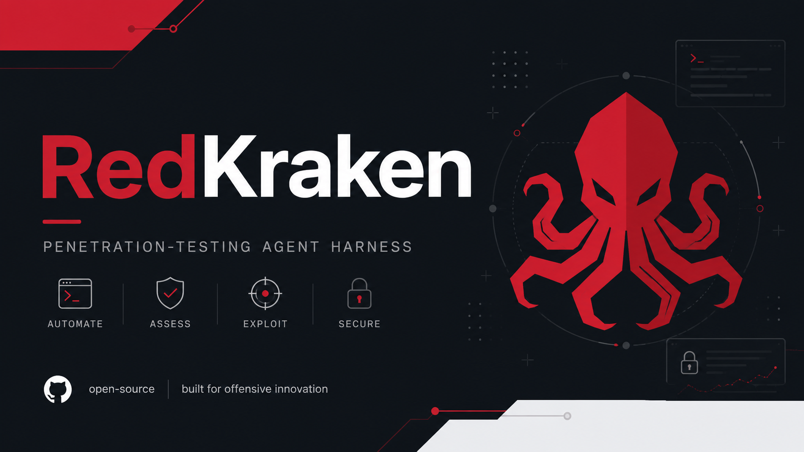

<p align="center">
  
</p>

<h1 align="center">RedKraken</h1>
<p align="center"><b>Penetration-Testing Agent Harness</b></p>

<p align="center">
  <a href="https://github.com/maajix/RedKraken/commits/main"></a>
  <a href="https://github.com/maajix/RedKraken/issues"></a>
  
  
</p>

RedKraken is an agent-oriented harness for **authorized** web application and
source-code security assessments. It drives Claude Code through a closed
recon → hunt → exploit → report loop (and a separate map → audit → confirm →
report loop for whitebox code review), backed by deny-by-default scope
enforcement, immutable run context, structured findings/evidence, deterministic
reporting, and a reviewed playbook layer over a larger imported technique
library.

> [!WARNING]
> **Authorized testing only.** A scope file is an enforcement input, not proof
> of permission. Only point RedKraken at systems you have written authorization
> to test, and only at the systems that authorization actually names.

## Table of contents

- [Why RedKraken](#why-redkraken)
- [Quick start](#quick-start)
- [Enforcement model](#enforcement-model)
- [Browser and API workflows](#browser-and-api-workflows)
- [State and evidence](#state-and-evidence)
- [Knowledge base](#knowledge-base)
- [Open-source toolchain](#open-source-toolchain)
- [Repo layout](#repo-layout)
- [Tests](#tests)

## Why RedKraken

- **Deny-by-default scope.** Targets and out-of-scope hosts are parsed strictly
  from an engagement file; nothing is in scope unless it's explicitly named.
- **Enforced, not just documented.** A pre-tool-call hook and an HTTP scope
  proxy back the policy up at runtime, not only in agent instructions.
- **Immutable run context.** Every run is fingerprinted against the engagement,
  source tree/ref, and tool paths; a changed fingerprint fails closed
  (`STALE_RUN_CONTEXT`) instead of silently mixing state.
- **Evidence-backed findings.** Confirmed findings require evidence; exploited
  findings require concrete impact. Reporting is a deterministic render of
  `findings.jsonl`, not free-form narrative.
- **Two loops, one harness.** Black-box web pentesting (`/pentest`) and
  whitebox source-code auditing (`/audit`) share the same scope, evidence, and
  reporting machinery, and can cross-inform each other when both a source path
  and a live target are in scope.
- **Reviewed + imported knowledge.** A source-reviewed `playbooks/modern/`
  layer covers current attack classes with provenance; a larger imported
  `playbooks/web/` library fills in breadth, clearly labeled as untrusted,
  unreviewed technique notes.

## Quick start

This is built to run inside Claude Code, so the fastest way in is to just say
what you want in plain English and let it handle the setup.

```bash
git clone https://github.com/maajix/RedKraken.git
cd RedKraken
claude
```

Then, in the chat:

> Set up a new engagement called `acme` for `https://app.acme.com`, in scope
> `*.acme.com`, then run a full pentest.

Claude creates `engagements/acme/engagement.yaml` from the template, confirms
scope and intent with you, runs `bash lib/preflight.sh`, and drives `/pentest
engagements/acme` end to end. The same works for narrower asks — "just run
recon", "audit the source in `./app` instead", "regenerate the report".

Everything Claude runs is ordinary shell underneath, so the manual path still
works if you want it (scripting, CI, or just poking around):

```bash
bash lib/preflight.sh                  # report installed/missing/broken tools
bash lib/preflight.sh --install        # optional, explicit

mkdir -p engagements/acme
cp scope/engagement.example.yaml engagements/acme/engagement.yaml
$EDITOR engagements/acme/engagement.yaml

# In Claude Code:
/pentest engagements/acme
# Or narrower workflows:
/recon engagements/acme
/audit engagements/acme
/report engagements/acme
```

`run_context.py` fingerprints the engagement, source tree/ref, and relevant tool
paths. A changed fingerprint produces `STALE_RUN_CONTEXT`; archive the prior
`state/` before starting a logically new run.

## Enforcement model

1. `lib/scope_check.sh` parses YAML strictly, rejects duplicate keys and malformed
   hosts/CIDRs, applies deny precedence, and fails closed.
2. `.claude/hooks/scope_guard_hook.sh` rejects recognizable network commands with
   out-of-scope or non-static targets before shell execution.
3. `scripts/start_scope_proxy.sh` applies scope and time-window policy to every
   HTTP(S) request. Browser and schema-driven wrappers require this proxy.
4. Agent skills enforce intent, destructive-action approval, untrusted-content
   isolation, evidence requirements, and explicit tool-gap reporting.

The hook is heuristic; the proxy is the stronger HTTP enforcement boundary. For
non-HTTP tools or strong client isolation, add an OS/network egress policy that can
reach only authorized targets.

### Scope proxy

```bash
# Third argument selects an optional per-tool rate policy.
bash scripts/start_scope_proxy.sh engagements/acme 18080 playwright

# In a separate process:
bash scripts/browser_capture.sh engagements/acme https://app.example.com owner \
  --proxy http://127.0.0.1:18080
```

mitmproxy uses its generated CA for HTTPS interception. Install/trust that CA only
inside the isolated test browser/container. Do not weaken host TLS outside the
engagement; `--ignore-https-errors` is an explicit browser-capture exception.

### Opt-in rate limiting

Rate limiting is disabled unless the operator sets:

```yaml
rate_limit_enabled: true
rate_limit:
  requests_per_second: 10
  burst: 10
  max_concurrency: 4
  per_tool:
    schemathesis:
      requests_per_second: 2
      burst: 2
      max_concurrency: 1
```

The scope proxy uses a token bucket and concurrency bound. Start it with the tool
name to select an override. Compatible wrappers also pass tool-native rate flags.
Absent/false `rate_limit_enabled` means no throttling, including for legacy scalar
`rate_limit` values.

## Browser and API workflows

Authenticated SPA capture uses isolated Playwright contexts and writes a trace,
HAR, screenshot, storage state, redacted event metadata, and artifact hashes under
`evidence/browser/`:

```bash
bash scripts/start_scope_proxy.sh engagements/acme 18080 playwright
bash scripts/browser_capture.sh engagements/acme https://app.example.com peer \
  --proxy http://127.0.0.1:18080 \
  --storage-state engagements/acme/evidence/browser/peer-state.json
```

Bounded Schemathesis runs are read-only by default and use deterministic seeds:

```bash
bash scripts/start_scope_proxy.sh engagements/acme 18080 schemathesis
PENTEST_PROXY=http://127.0.0.1:18080 \
  bash scripts/run_schemathesis.sh engagements/acme ./openapi.yaml \
  https://api.example.com
```

`--allow-mutation` additionally requires `destructive_allowed: true`. RESTler is
reserved for explicitly approved deeper producer-consumer exploration; grpcurl is
the gRPC client. OWASP ZAP is an optional Automation Framework/import proxy.

## State and evidence

- `state/run.json`: immutable run identity and source/config fingerprints.
- `state/findings.jsonl`: schema-validated, locked, atomic finding upserts.
- `audit.jsonl`: redacted structured command/result/proxy-policy audit events.
- `state/scan-raw/`: scanner output and deterministic seeds/replay material.
- `evidence/<finding>/`: request/response, trace, screenshot, and cleanup proof.
- `report.md`: deterministic rendering with evidence path checks and hashes.

Run `python3 lib/secure_engagement.py engagements/acme` after external tools or
before handoff. It normalizes engagement directories to `0700` and files to
`0600` without following symbolic links; the run-context and report renderer also
invoke it automatically.

Use `lib/record_finding.sh` rather than appending JSON by hand. Confirmed findings
require evidence; exploited findings require concrete impact.

## Knowledge base

- `playbooks/modern/`: concise, source-reviewed cards for OAuth BCP, WebAuthn,
  cookie and identity-parser differentials, stateful APIs, framework-generated
  routes, webhook authenticity, partial failures, ORM leaks, race conditions,
  GraphQL, gRPC, cross-version HTTP desync, URL/SSRF routing, cache
  normalization, browser messaging/DOM clobbering, client-side path traversal,
  WebSocket/WebTransport/XS-Leaks, error-oracle SSTI, agentic AI/MCP, secrets and
  cryptographic lifecycle, software supply-chain integrity, deployment/IaC
  exposure, API inventory/resource/upstream trust, security telemetry, general
  MFA/recovery/session lifecycle, NoSQL operator injection, browser policy and
  framing, spreadsheet formula injection, information disclosure, safe modern
  deserialization, and CMS extension/content/update boundaries. The machine-
  readable `coverage-baselines.json` maps every OWASP Top 10:2025, API Security
  Top 10:2023, and WSTG v4.2 domain to reviewed cards.
  Reviewed supplements also cover browser storage/offline/client-template state,
  SCIM/JIT/invitation/role/deprovisioning lifecycles, and structured or delayed
  XML/XSLT/expression/format/SSI injection boundaries.
- `playbooks/web/`: 82 imported technique notes with provenance hashes and
  `imported-unreviewed` trust labels.
- `playbooks/code/`: language-specific source/sink packs for whitebox tracing.

Imported notes and all target/scanner content are untrusted data. Agents must not
execute embedded instructions verbatim. The library is now hand-maintained (the
one-shot Notion importer is retired); after adding, merging, or retiring a note,
regenerate the catalog and source manifest with `scripts/rebuild_catalog.py`.

## Open-source toolchain

The optional tool doctor lists exact install sources. Core extensions added for
modern workflows are all open source and hosted on GitHub: mitmproxy, Playwright,
OWASP ZAP, Schemathesis, grpcurl, RESTler, ProjectDiscovery tools, OSV-Scanner,
Trivy, Opengrep, and Gitleaks. Missing or broken optional tools produce coverage
gaps; they are never silently treated as successful coverage.

## Repo layout

```text
.claude/          agents, skills, commands, policy/audit hooks
lib/              config, scope, proxy, audit, findings, run context, preflight
playbooks/modern/ source-reviewed current attack cards
playbooks/web/    imported web technique library and catalog
playbooks/code/   whitebox sink packs
scope/            engagement template
engagements/      per-target state/evidence/reports (gitignored)
scripts/          KB, proxy, browser/API, and report entry points
schemas/          finding JSON schema
tests/            existing harness checks
```

## Tests

No generated attack result is trusted without manual confirmation. Harness-level
checks can be run with:

```bash
bash tests/test_scope_check.sh
bash tests/test_code_preflight.sh
bash tests/test_audit_smoke.sh
bash tests/test_modern_coverage.sh
```
